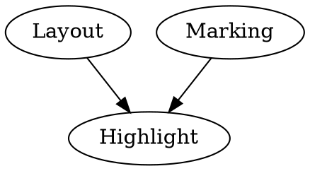
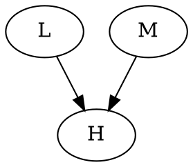
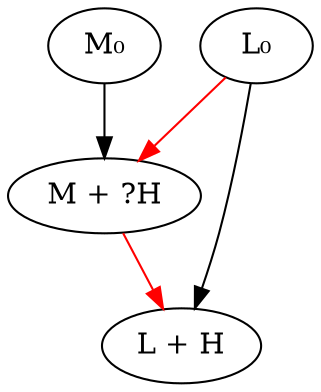
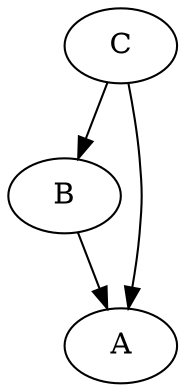
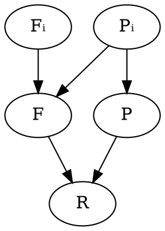

# Tasks

- [ ] Show self costs everywhere in a convenient way too?
- [ ] Flatten filter min width seem to be too big and looks bad when compressing right panel.
- [ ] Inhered search term for flattet view when creating new page
- [ ] No delta color in flatten view
- [ ] Kill animation of nodes that go from display `none` to `block` from reuse pool.
- [ ] Implement search
- [ ] Collapse recursion
- [ ] Implement clipboard copy
- [ ] Implement state saves
- [ ] Name tab "Selection" only when not everything is selected
- [ ] Introduce concept of `current` traits for `Deck` and when setting traits only current traits for current active page change.
- [ ] Deck must have an option for setting minimum node width
- [ ] Set node cursor to arrow (default) or pointer, shouldn't be selectable
- [ ] Use string table for node names
- [ ] Compare boot args
- [ ] Integrate `Terser` npm to compute constants and get some other optimizations
- [ ] Don't add fake "All" node in ardiff python (this item seems invalid now).
- [ ] Ensure updateTooltipPosition is as high/late in hierarchy as possible.
- [ ] [NTBF] Don't use 70% as initial split view proportions, since it results in fractional sizes
- [ ] [NTBF] Need to invalidate nodeContentState when delta changes, since layout is not neccessary in this case.

# Notes

## Core features

Thing is getting complicated and sometimes it feels like something is wrong in the very foundation of the states system. Keeping condensed list of core features and reasoning begind them hopefully will simplify rethinking of its most basic elements.

## Hard questions and decisions

Below is a list of questions and controversial decisions in their shord form, preferrably distilled to the minimal essence, so it's easier to keep track of them.

- How to transfer data from producer to consumer that are not implementation-aware of each other?
- How to accumulate producer output across several updates for consumer that updates less often?
- How to implement optimizations where certain states can (in some cases partially) compute consumers update more efficiently?
- How we can modify dependency graph during update phase, while preserving consistency?


## Ideas to think about later

These are ideas that poped-up while thinking about other things, so they were written down to come back to them later.

- When collecting dirty states during update it's possible (in theory it should be?) to do some extra invalidation for states don't want to be invalidated each time their dependency changes (for efficiency purposes). Example: timer state updates each update, but one consumer wants to be updated only each other (or 10th) update - how to do it without invalidation of all states that depend on such consumer for all updates. Basically when dependency graph is big, it's expensive to just invalidate-validate states, because each will require to traverse and modify many states.
- Can state be dirty but ask not to be updated during this update and this `-1` change count for all consumers?
- It should be possible to separate dependency subgraph class from its object to encourage reuse (so each instance doesn't carry data data that is common for all instances - this will also make construction much quicker).

## Initial state of `StateInput.status`

It's not settled that setting initial `status` of `StateInput` to `pending` is better than `changed`. Initially, `changed` was used, because newly created inputs need to be processed by their states. However, having initial value of `changed` means that certain `StateInputTraits` callbacks will not be called (specifically `reset()`). To allow use of `StateInputTraits` as a mediator between two states (e.g. to send `width` value from producer to consumer), initial value of `StateInput.status` was (artificially?) changed to `pending`, so those callbacks are called for newly created inputs. Following helper was added and then removed to facilitate such use of `StateInput`.

```javascript
// Returns `StateInputTraits`-like object that can be used to transfer information
// from one `State` to another via `StateInput`. Example:
//   consumer.state.input(provider.state, StateInput.updater(() => { consumer.value = provider.value }))
static updater (updater) {
  return {send: updater, reset: updater}
}
```

Later it was decided that it's better to use explicit extra `State` object for such purposes. See **Data Transfer** section below for details.

## Data Transfer

It's a common pattern where state `A` computes some value which is used by state `B` that depends on `A`. Such arrangement is  problematic when `A` and `B` don't know about each other (e.g. `B` allows to set `width`, but doesn't care where exact value comes from, while `A` tracks `width` of some UI element and doesn't care who reads it). Since both states are independent, transfering data from one to another requires extra efforts.

Two options generally possible:

1. Add extra state `X` and make it depend on `A` and make `B` depend on `X`. Since `X` knows about both `A` and `B` it can take value from `A` and transfer it to `B` in its update function.
2. Allow inputs to do it. When connecting `A` and `B`, `StateInput` object is created that establishes dependency relationship between them. Such input object can be provided by a suitable callback that transfers data from `A` to `B`.

Second option looks more elegant, since it doesn't require extra entities and reuses existing infrastructure. However, it is not exactly compatible with current `StateInputTraits` infrastructure that was designed earlier for similar purposes, but with focus on tracking and accumulation changes (which seems like a wrong layer/level for this). Because of that, first option is currently used to do it.

However it worth exploring removing `StateInputTraits` all together and replacing them with a single callback. It's not clear when this callback will be called and what parameters it will have. When to call it is an interesting question. Certain things to consider.

1. States can transfer from `dirty` to `clean` in their update callback (in `action` callback via call to `State.cancel()`) which will mark state's output as unchanged. This fact must be kept in mind when considering different option about callback timing.
2. It's desired to be able to accumulate changes. It's possible that state `B` that depends on `A` is not a part of each update that updates `A`. It should be possible for `A` to accumulate changes comming from `B`. E.g. if output of `A` is a set of updated nodes, `B`  should be able to accumulate nodes for several updates of `A` for where `B` wasn't updated, so when `B` finally updates it knows what happened to `A`. This is basically why `StateInputTraits` contraption was created.

Two obvious places to call proposed callback are:

1. Just after producer transfers from `dirty` to `clean` (or to be more precise - just after producer is updated, since it looks like there is some merit in allowing certain states to remain dirty even after they are updated.
2. Just before consumer is updated.
3. And a third option of course is to have both callbacks.

Second option is nice since it's very efficient - data transfer will only happen when consumer is actually updating. However it will not allow change accumulation, since this requires invocation after each producer update. Using first option though doesn't address problem completely still, because for that the "change" should be part of producer's state, which it can't be, because this "change" is different for each consumer (since not all consumers are updated in the same update as the producer).

## Output accumulation

There is two types of output - additive (change) and setitive (value) (interesting analogy with bosons and fermions particles). Setitive outputs have a particular value and it doesn't make sense to combine several such values from several updates (e.g. `width` of layed out UI element). Additive output reflects change relative to previos state and thus such changes can be combined across several updates to describe change that happened during these updates.

Value outputs (fermions) seem to be simple, since they follow `set` semantics and don't require any complex book keeping.

Change outputs (bosons) are hard. Each output input must be treated separately, since each output input has its own accumulator (conceptually - not implying that accumulator must be phisically stored in output input object - in fact there are benefits in storing accumulator in consumer state instead).

Questions:

- Where to store accumulator - output input, consumer state or don't impose specific choice and leave both options available?
- How producer presents the change output (how it reports it)?
- How presented change output is integrated into each output input?
- Is there a need to be able to explicitly express "no change" change output (e.g. when producer changed i.e. wasn't canceled, but there was no change that can be expressed as change output)?
- Is there a need to be able to explicitly express "total change" change output (e.g. when everything changed and there is no point to specify each change individually)?
- Is there a need to handle input attach / detach as input methods as in `StateInputTraits` currently?
- Don't forget that state update can "forget" to publish an update - in that case default behavior should be something reasonable.

## Entangled States

Consider following states - `Layout`, `Marking` and `Highlight`, where `Highlight` depends on both `Layout` and `Marking`.



However, as an optimization, `Highlight` can be done as part of `Layout` or `Marking ` more efficiently. But it would be a waste to do `Highlight` twice when both `Layout` and `Marking` are updating - in this case `Layout` can do `Highlight` more efficently, but for that to work it needs to be updated after `Marking` is updated.

Question is how to express this kind of dependency, so it can be understood by mechanical process that updates states.

To simplify typing and to be more generic, we will continue with abstract states `L`, `M` and `H`.



Desired update matrix:

```
| Changed |                   |
+----+----+      Updates      |
| L  |  M |                   |
+----+----+-------------------+
| 0  |  0 | -                 |
| 0  |  1 | (M + H)           |
| 1  |  0 | (L + H)           |
| 1  |  1 | (M), then (L + H) |
+----+----+-------------------+
```

Notice, that in this particular case question boils down to whether `H` must be done as part of `M`, but to answer this question we need to know whether `L` will be updating. However, since `L + H` must be done after `M` (if `M` needs updating), it's not easy during `M` update to tell whether `L` will be updating as well (because other states `L` depends on can validate or cancel it, potentially after `M` has been updated).

Dealing with entangled states is complicated, because lower (states on which other states depend on) can validate (mark as updated via `state.send()`) or cancel (mark as unchanged via `state.cancel()`) higher states. Not all validations and cancelations are legal though. Generally, state that validates or cancels other state should have all the inputs that state being validated or canceled has. This ensures that state has all the same information that other state to validate or cancel it. There are exceptions of course, when certain changes in state `A` make some inputs of dependent state `B` to be irrelevant - in that case, state `A` doesn't need to have all the inputs that `B` has. Such cases has one thing in common - dependency information is not reflected fully in dependency graph (in this example - certain inputs of state `B` are only relevant for certain `modes` of state `A`). This can be refered as **higher order dependencies** - dependencies that depend on other dependenices.

It's neccessary to admit, that state dependency graph is a very rigid entity. Though it's legal to modify dependency graph during invalidation stage (when states are marked as dirty via `state.invalidate()` call), such modifications are not performed on "final" (or maybe "complete" is a better work) graph state, since it's not what other states will be invalidated before update stage is invoked (via `state.update()` call). During update stage we have complete up-to-date information for each updating state (when it's updating), however currently it's not legal to modify dependency graph at this stage.  Dependency changes are prohibited because they can introduce inconsistencies into the graph.

Hard questions for original problem (with `L`, `M` and `H` states) are:

1. How `L + H` state can be updated after `M + H` without having dependency on it (because such dependency will cause invalidation of `L + H` each time `M + H` is invalidated).
2. How `M + H` can be updated before `L + H`, while knowing definitely whether `L + H` will be updating.

First step in solving this problem is to split `M` and `L` states, on `X₀` and `X + H` (where `X` can be either `L` or `M`). `X₀` state decides whether `X + H` need to be updated and requires that nobody validates or cancels `X + H` (it's an easy requirement to satisfy, since at this point state `X + H` is an internal implementation detail which is not exposed.



This addresses second question - how `M + ?H` knows whether `L + H` will be updating, while still being able to update before it.

To answer first question we need to look at dependencies marked `color=red` on digraph above. This dependencies establish order, but should not cause chain invalidation (e.g. when `L₀` becomes dirty, it should not dirty `M + ?H`). So one possible solution is to add **order-only** dependencies. Such dependencies would be followed when building ordered list of states that require update, but will not be followed when states are invalidated. Easy way to implement this is by using `StateInput` with `consumer` set to `null`. That way consumer will still have full list of states it depends on (including order dependencies) via `State.inputs` list, but such consumer will not be discoverable by producers by following their `State.outputInputs`.

Interesting aspect of **order-only** dependencies is that consumer should still be able to know whether producer changed. But it's important to understand, that "changed" is a meaningless characteristic of a producer. Producer can be dirty, which means that its action must be invoked to update it and make it clean. That's the only two states producer (or consumer, since these are just different roles of `State` objects) can be in - `dirty` and `clean`.  What CAN be considered "changed" is producer's output, which consists of `StateInput` objects in `State.outputInputs` list. This is important, because in state split above we use `X₀` state as indicator that associated state `X + H` will be updated, even though state `X₀` doesn't have any output to produce that can be considered changed - it just aggregates inputs.

This inputs aggregation presents an interesting issue, since it could be that state `X + H` needs to know status of individual inputs that `X₀` aggregates (e.g. to decide how to update most efficiently). Obvious way to handle it is to replicate all relevant `X₀` inputs on `X + H` too. While redundant, it doesn't seem like it can cause issues, other than efficiency. **But that's a good argument for why such state splits are not such a great idea**. Also, by duplicating inputs we risk to run out of sync (add/remove input to `X₀`, but not to `X + H` or vise versa) - this will break contract that `X₀` reflects whether `X + H` will be updating.

Other interesting aspect is that there is an important difference between state being "dirty" and "will be updating". Since it's possible to update any arbitrary subgraph, it could be that (as in our case) state `M + H` will be updating, but `L + H` is just dirty - i.e. it will not be updated as part of current update `M + H` state is part of. Everything above implies identity between these two different concepts, which is not strictly correct.

One way of looking on original problem (with `L`, `M` and `H` states) is that we have two types of dependencies - **data** dependencies and **effect** dependencies. Effect dependency is when one state depends on other state to do something. It's different from data dependency (which is more functional and stateless) in that it expresses higher level effects of state update. For example, if `B` has an **effect** dependency on `A` it could mean that `A` does something `B` cares about (maybe not on its own, but in context of other changes).

**Note**: The scope of `H` update (what exactly needs to be done) is different depending on what changed. E.g. when small thing changes closer to the graph's top, `H` can do very little, while when big thing changes closer to the graph's bottom, `H` needs to redo everything. This complicates this problem, because now each state (`M` and `L` in our case, but it could be more) needs to decide the scope of the update.

`M` can know that `L + H` state (that has conditional dependency on `M`) is dirty (and therefore is planned to be updated some time after `M` updates). It can't know for sure, whether `L + H` will be actually updated, because other states that are updated between `M` and `L + H` can validate `L + H`. But, `M` can force (require) `L + H` to update. In current implementation it's as easy as calling `State.invalidate()` for `L + H` state from `M` update (action) function if `L + H` state if `L + H` state is dirty.

Another way to view at it, is that after `M + ?H` state decides that it will not do `H` part, it **requires** `L + H` to update no matter what - until there is other competent participant that can do whatever `L + H` is supposed to do. This can be expressed as an extra state between `M + ?H` and `L + H` on which anybody who wants to do `L + H` work need to depend as well.

## Dynamic vs Static State inputs

It could be valuable to separate states on two categories - states with fixed inputs and states that can have inputs added to them (and removed). Same applies to producers - some producers could be only present in fixed place and can't be added as input to other states, while others can.

## Higher Order dependencies

If state `A` wants to know whether output of other state `C` deep in the graph changed, it's common to add an explicit dependency to deliver this information to `A`. This works perfectly with the exception that it can invalidate state `A` when it shouldn't be invalidated. Consider:



Here, during update phase, `B` can decide that its output didn't change and since `B` is the only input of `A`, this would validate `A` as well transitively. However, `A` also depends on `C` directly, and since `C` changed, `A` will remain dirty. There is no right or wrong here - some cases require such invalidation (if `A` realy depends on output of `C`), while others don't (when `A` only needs output of `C` when `B` changes - it can be rephrased as input `C -> A` has a "detail" `C -> A`). This brings us again to the topic of **conditional dependencies** and **higher order dependencies**. Later case is actually more interesting than it seams, because `B` subgraph can be updated individually, which raises a question - what inputs of `A` should be considered `changed` when `A` is updated - specifically should `C` output considered changed or not?

One way to adress this is to introduce new kind of dependencies - one that doesn't cause invalidation, but establishes ordering relationship and continues to track output changes. More involved scheme can require to specify what inputs need to be changed for state to be invalidated (for example using bit vector of length `2^N`, where `N` is a number of inputs with `1` indicating that state should be invalidating and `0` that is not). Such scheme can have very interesting applications, however it's not clear how practical such applications could be. **Is it possible to find some example where such more complicated scheme will be more useful that just simple flag on the input?** In table below `Tᵢ` is input that is specially marked to be a special kind of dependency described above. `Normal` column shows when state that has both `Tᵢ` and `Rᵢ` as inputs will be considered dirty. `Marked` is dirty behavior when mark is taken into account. `C₁`, `C₂`, `C₃` and `C₄` are extra posibilites that are not possible with just marking / special kind of input. Question is - are any of these `Cᵢ` is any useful.

| Tᵢ | Rᵢ | Normal | Marked | C₁ | C₂ | C₃ | C₄ |
|----|----|--------|--------|----|----|----|----|
| 0  | 0  | 0      | 0      | 0  | 0  | 0  | 0  |
| 0  | 1  | 1      | 1      | 1  | 0  | 1  | 0  |
| 1  | 0  | 1      | 0      | 1  | 0  | 0  | 1  |
| 1  | 1  | 1      | 1      | 0  | 1  | 0  | 0  |

`C₂` is analog of `and` operation that will invalidate state only when both outputs are considered `changed`. Also this technically allows for state to be considered `dirty` when all its inputs didn't change. This can be an interesting way to create states that must always be evaluated. One interesting application can be with "change producers" where consumer uses only part of change and leaves other part for following updates. Another application could be something like state that generates timestamp for current update. Later example is an interesting case by itself, since not all consumers would like to be updated with the same fidelity / frequency, so it's interesting whether it's possible to limit invalidation.

`C₃` and `C₄` are useful when state must be updated only when specific input changes, while other remain unchanged (e.g if other input changes, that means that producer already computed everything need and this state doesn't need to do anything.

As for semantic meaning of such special dependencies, I found it's convenient to think about them as a **conditional dependencies** that only matter when other inputs are changed as well.

## Conditional dependencies

Idea of conditional dependencies was born out of necessity to have dependencies that don't invalidate consumers. **Why whould you want a producer-consumer dependency that doesn't invalidate consumer?** Mostly for optimization purposes. While pure dependency graph is a neat thing, its structure is to rigid for certain optimization oportunities. It's common that certain thing can be done completely (in full) or partially - of course partial variant is less costly. Notice that full thing includes partial thing, so whaterver partial thing is doing, full thing needs to do it too. Thus, full thing should depend on everything that partial thing depends on (there are some technical exceptions, but for the most part that's the requirement). Such dependency requirement makes it hard to do partial thing without doing full thing (because anything that invalidates partial thing will also invalidate full thing and require its update). Consider following graph:



Here `F` and `P` produce result `R`. When `Fᵢ` changes we need to do a full thing and update `F`, while when **only** `Pᵢ` changes we can do partial thing `P` and update `R` more efficiently.

One way to look at this is that there are two independent state `F` and `P` where each does its own thing. However, in certain cases `F` can do its own work **and** everything that `P` is going to do too. It's a different perspective, but doesn't change the problem that to do that `F` needs to depend on everything that `P` depends on, which makes it impossible to invalidate `P` individually.

One importand side effect of conditional dependencies is that they still establish order relationship between states. Sometimes it may look like conditional dependency is just used for the sake of ordering it provides, but after more careful examination "legitimate" conditional dependency usually is found.

One way to resolve that is to notice that `F` doesn't care about `Pᵢ` changes until `Fᵢ` also changes. `Pᵢ -> F` is a conditional dependency that matters only when output of `Fᵢ` changes.

**What if state (consumer) has only single conditional input?** Invalidation will stop at producer state and will not invalidate consumer. Update will ignore consumer (since it's clean) and thus will not go deeper to collect producer's subgraph.

**What if state (consumer) has one conditional input and one normal input?** Invalidation will procede to consumer only if conditional dependency predicate tells to invalidate the consumer. In simple case that means if only conditional dependency changed, then consumer will not be invalidated (though its corresponding input will still be marked as `changed`). Update follows conditional dependency if consumer is invalidated and dependency is changed.

## Graph modifications during update phase

Is it should be considered legal to modify already updated subgraph? Only hard case I think of is when adding new states to the graph - such states will be considered dirty and will invalide the graph (including states that are still to be updated). This also can dirty states that were clean and thus were not included in update pass at all. Options:

- Delay invalidation till update ends
- Prohibit to do it
- Deal with that in a smart way

One interesting limitation that can be introduced is that only currently updating state is allowed to add new inputs and only to itself. Then it can update added subgraph in a nested pass, add inputs to itself and update itself, thus the entire subgraph will be clean.